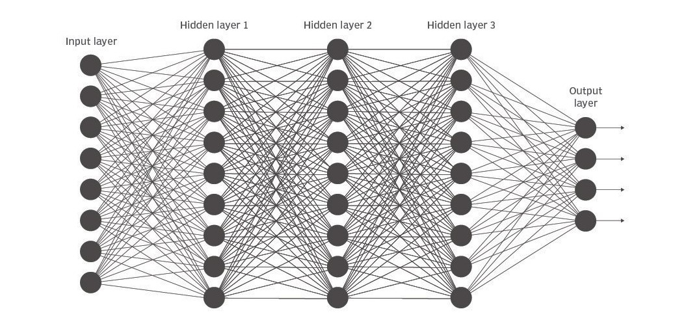
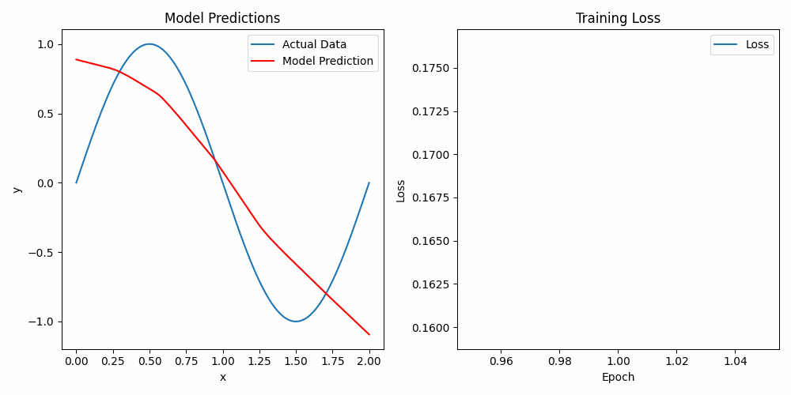
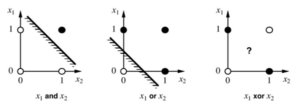
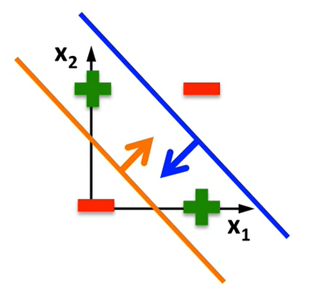
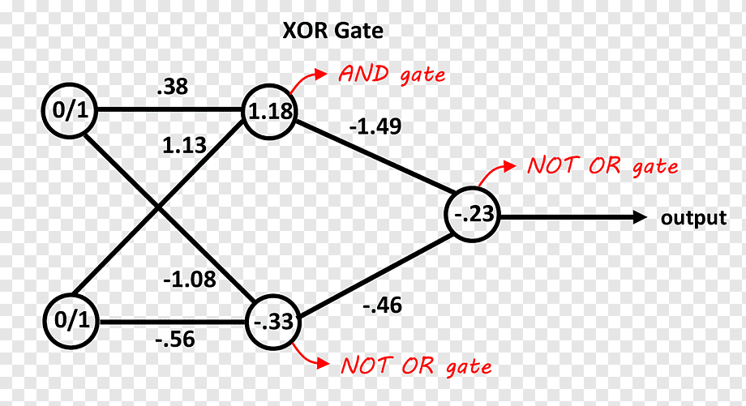

# Deep Learning Basics

Two small experiments show how fully connected neural networks learn a continuous function and a nonlinear decision boundary. Start with the notebooks, then use the explanations below to connect their layers, losses, and training loops to the results you see.

| Notebook | Task | Frameworks |
| --- | --- | --- |
| [Sine_Prediction.ipynb](Sine_Prediction.ipynb) | Fit one period of a sine wave with a multilayer perceptron | PyTorch and TensorFlow/Keras |
| [XOR.ipynb](XOR.ipynb) | Learn the four cases of the XOR truth table | TensorFlow/Keras |

Both notebooks generate their data in memory. No dataset download or GPU is required.

## Getting started

Use a Python version supported by both frameworks; Python 3.11 is a suitable starting point. Check the official [PyTorch](https://pytorch.org/get-started/locally/) and [TensorFlow](https://www.tensorflow.org/install/pip) installation guides for your operating system. This repository does not pin package versions.

From a terminal, create an environment and launch [JupyterLab](https://jupyter.org/install):

```bash
git clone https://github.com/kapshaul/deep-learning.git
cd deep-learning
python3.11 -m venv .venv
source .venv/bin/activate
python -m pip install --upgrade pip
python -m pip install jupyterlab ipykernel numpy matplotlib imageio torch tensorflow
python -m ipykernel install --user --name deep-learning --display-name "Python (deep-learning)"
python -m jupyterlab
```

On Windows, activate the environment with `.venv\Scripts\Activate.ps1` in PowerShell instead of `source`. Use the interpreter name available on your machine when creating the environment.

1. Open either notebook and select the **Python (deep-learning)** kernel.
2. In `Sine_Prediction.ipynb`, skip the first installation cell if you installed the dependencies above. Run the remaining cells from top to bottom: shared imports and data, PyTorch training, then TensorFlow training.
3. In `XOR.ipynb`, run all cells in order. The notebook prints the model summary, selected weights, and training metrics.
4. Restart the kernel before repeating an experiment if you want to rebuild its model and optimizer from scratch.

`imageio` appears in the sine notebook's installation cell but is not used by its current training code. The sine notebook imports both frameworks together, so both must be installed even if you run only one training section.

## How the networks learn

A fully connected layer applies an affine transformation, followed by an optional activation:

$$
z = Wx + b, \qquad a = \phi(z).
$$

Weights and biases are learned from data. Nonlinear activations let stacked layers represent more than a single affine mapping; without them, a sequence of dense layers would still be affine.

<p align="center">
  
</p>

During training, a forward pass produces predictions, a loss measures their error, backpropagation computes gradients, and an optimizer updates the parameters. The PyTorch example writes these steps explicitly; Keras handles them inside `model.fit`.

### Activation functions

| Function | Definition | Role in these notebooks |
| --- | --- | --- |
| ReLU | $\max(0, z)$ | Hidden layers of the sine models; allows a piecewise linear approximation |
| Sigmoid | $1/(1 + e^{-z})$ | Hidden and output layers of the XOR model; output lies between 0 and 1 |
| Tanh | $\tanh(z)$ | Shown for comparison in the illustration; not used by these models |

<p align="center">
  
</p>

## Sine function prediction

Open [Sine_Prediction.ipynb](Sine_Prediction.ipynb). The generated training set has **401 points**, with $x$ running from $0$ to $2$ in increments of $0.005$ and target

$$
y = \sin(\pi x).
$$

Both implementations use the same layer widths:

```text
1 input → Dense(50) + ReLU → Dense(50) + ReLU → Dense(1)
```

The output layer is linear so the network can predict both negative and positive values. The loss is mean squared error:

$$
\mathcal{L}_{\mathrm{MSE}} = \frac{1}{B}\sum_{i=1}^{B}(\hat y_i-y_i)^2,
$$

where $B$ is the number of examples in the current batch.

| Setting | PyTorch section | TensorFlow/Keras section |
| --- | --- | --- |
| Optimizer | Adam | Adam |
| Learning rate | `0.01` | `0.01` |
| Batch size | `32` | `32` |
| Epochs | `20` | `30` |
| Training entry point | Explicit forward/backward/update loop | `model.fit` with a plotting callback |
| Plotted loss | Final mini-batch loss of each epoch | Epoch loss reported by Keras |

The plots update after each epoch, showing the fitted curve and loss history. The bundled animation illustrates the approximation process:

<p align="center">
  
</p>

A ReLU network's fitted curve consists of linear segments. Changes in slope arise as activation patterns change; individual bends do not necessarily correspond to individual training samples.

The PyTorch and Keras loss curves use different aggregation, and the sections run for different numbers of epochs. They illustrate two training APIs rather than provide a controlled performance comparison. Both fit and display the same generated points; the notebook does not measure held-out error or extrapolation beyond $[0,2]$.

## XOR classification

Open [XOR.ipynb](XOR.ipynb). XOR is true when its two binary inputs differ:

| $x_1$ | $x_2$ | Target |
| --- | --- | --- |
| 0 | 0 | 0 |
| 0 | 1 | 1 |
| 1 | 0 | 1 |
| 1 | 1 | 0 |

A single linear decision boundary cannot separate the two positive cases from the two negative cases. Nonlinear hidden units allow the network to combine multiple boundaries.

<p align="center">
  
  
</p>

The logical identity $\mathrm{XOR}(x_1,x_2) = (x_1 \lor x_2) \land \neg(x_1 \land x_2)$ gives an intuition for combining hidden features. Training learns continuous weights and biases; it does not assign a fixed Boolean gate to each neuron.

The implemented network is:

```text
2 inputs → Dense(2) + sigmoid → Dense(1) + sigmoid
```

<p align="center">
  
</p>

The output is trained with binary cross-entropy:

$$
\mathcal{L}_{\mathrm{BCE}} = -\frac{1}{B}\sum_{i=1}^{B}\left[y_i\log p_i+(1-y_i)\log(1-p_i)\right],
$$

where $p_i$ is the sigmoid output for example $i$. The notebook uses Adam with learning rate `0.1`, batch size `64`, and `10` epochs. It repeats the four truth-table rows **5,000 times**, yielding 20,000 training rows but only four distinct inputs.

After training, you can add this cell to inspect those four cases directly:

```python
inputs = np.array([[0, 0], [0, 1], [1, 0], [1, 1]], dtype=np.float32)
probabilities = model.predict(inputs, verbose=0).reshape(-1)
print("Probabilities:", probabilities)
print("Predicted classes:", (probabilities >= 0.5).astype(int))
```

The target classes are `[0, 1, 1, 0]`. Random initialization is not seeded, so the code does not guarantee that every run converges within ten epochs. Reported accuracy is training accuracy on repeated truth-table rows. The `print_weights` helper prints only the first layer's weight matrix, not every layer or its biases.

## Related projects

Continue with a topic-specific repository:

- [deep-learning-cnn](https://github.com/kapshaul/deep-learning-cnn): convolution, pooling, and MNIST image classification.
- [deep-learning-rnn](https://github.com/kapshaul/deep-learning-rnn): RNNs and LSTMs applied to sequential MNIST.
- [deep-learning-math](https://github.com/kapshaul/deep-learning-math): matrix dimensions, gradients, and backpropagation implemented in MATLAB.

## API references

- [PyTorch linear layers](https://docs.pytorch.org/docs/stable/generated/torch.nn.Linear.html)
- [Keras dense layers](https://www.tensorflow.org/api_docs/python/tf/keras/layers/Dense)
- [Keras binary cross-entropy](https://www.tensorflow.org/api_docs/python/tf/keras/losses/BinaryCrossentropy)

## License

[MIT](LICENSE).
